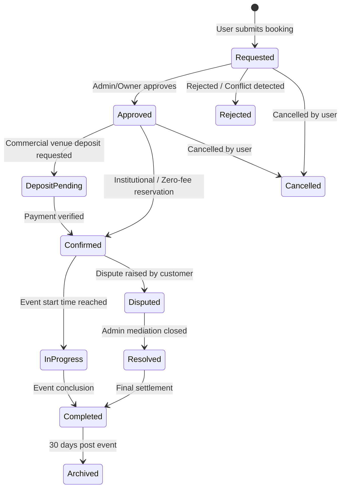

# VENBOK PRO — Intelligent Venue Discovery, Booking & Optimization Platform

**VENBOK PRO** transforms venue and space scheduling from a basic internal classroom-reservation app into a full-scale, multi-tenant, intelligent venue discovery, event planning, reservation, and asset utilization optimization ecosystem.

Built to seamlessly serve both **Educational Institutions** (such as Sri Eshwar College of Engineering) and **Commercial Venue Owners / Event Organizers**, VenBok Pro delivers AI-guided recommendation scoring, automated requirement planning, dynamic pricing advice, 10-state booking workflows, conflict locking, digital checkout, verified ratings, and transparent dispute arbitration.

---

## 🌟 Key Highlights & Architectural Pillars

### 1. Dual Operating Modes
VenBok Pro features a one-click mode switcher in the global navigation bar:
- 🏛️ **Institution Mode**: Optimized for universities, colleges, and internal campus faculties. Focuses on academic timetable compliance, departmental approvals, student club permits, lab reservations, and room utilization without commercial fee barriers.
- 🎪 **Marketplace Mode**: Public-facing commercial discovery platform for convention centers, banquet halls, corporate auditoriums, open-air lawns, and private venues. Enables public search, transparent hourly/daily pricing, online payments, and deposit management.

---

### 2. Three User Ecosystems & Dedicated Hubs

| Persona | Primary Role | Dedicated Experience & Actions |
| :--- | :--- | :--- |
| **Customer / Event Organizer** | Corporate planners, clubs, wedding/exhibition hosts | **Customer Dashboard** (`/dashboard/customer`): Upcoming events, visual 5-step status stepper, UPI/Card payment modal, invoice receipts, bookmarked spaces, verified review submission, and dispute tickets. |
| **Venue Owner** | Commercial venue managers, private auditorium operators | **Owner Dashboard** (`/dashboard/owner`): Real-time occupancy %, revenue yield, seasonal demand forecasting, smart dynamic pricing advisor (+15-20% surge or weekday discount prompts), and promotional discount campaign creator. |
| **Super & Campus Admin** | Institutional heads, facility managers, platform arbiters | **Super Admin Console** (`/dashboard/admin`): Verification badge manager (`Unverified`, `Verified ✓`, `Premium Verified ★`), full 10-state booking lifecycle overrides, dispute arbitration mediation desk, and multi-tenant organization manager. |

---

### 3. AI & Intelligent Decision Engines

#### A. Natural Language Query Parser (`POST /api/intelligence/parse-query`)
Parses conversational queries into structured parameters:
- *Example input:* `"Air-conditioned auditorium for 500 guests with sound system under 40000 in Coimbatore"`
- *Parsed attributes:* `{ capacity: 500, maxBudget: 40000, eventType: "Seminar", facilities: ["Sound System", "Air Conditioning"], city: "Coimbatore" }`

#### B. Explainable Multi-Factor Recommendation Engine (`POST /api/intelligence/recommend`)
Scores each candidate venue out of 100 based on a weighted multi-factor formula:
$$\text{Total Score} = 0.35 \times S_{\text{capacity}} + 0.25 \times S_{\text{facilities}} + 0.20 \times S_{\text{budget}} + 0.10 \times S_{\text{rating}} + 0.10 \times S_{\text{availability}}$$
Every recommendation displays human-readable badge reasons (e.g. *"94% Match: Perfect 500 capacity fit • Matches all technical AV prerequisites • Within budget"*).

#### C. Event Requirement Architect & Planner (`GET /api/intelligence/event-plan`)
Guides event organizers through 7 distinct event profiles (*Tech Hackathon, Academic Conference, Corporate Product Launch, Cultural Gala, Hands-on Lab Workshop, Executive Board Meeting, Sports Tournament*). Automatically calculates:
- Safety and staging capacity buffers ($+15\%$ to $+25\%$)
- Essential technical requirements (high-capacity power drops, static IPs, green rooms, PA acoustics)
- Optimal stage, seating, and banquet layout recommendations

#### D. Tiered Smart Cost Estimator (`POST /api/intelligence/cost-estimate`)
Delivers realistic, three-tier budget models (*Budget, Recommended, Premium*) with itemized breakdowns for base rental, technical equipment, facility fees, catering, and 18% statutory GST.

#### E. Space Utilization & Demand Analytics (`GET /api/intelligence/utilization`)
Measures asset efficiency across the entire inventory:
$$\text{Utilization Percentage} = \left(\frac{\text{Total Booked Slot Hours}}{\text{Total Available Slot Hours}}\right) \times 100$$
Identifies peak demand days, underutilized weekday windows, and advises owners when to apply dynamic surge pricing or promotional flash discounts.

---

## 🔄 10-State Booking Lifecycle & Conflict Locking

Every reservation passes through a protected lifecycle managed by backend state validation:



- **Conflict Prevention**: Overlapping time slots are evaluated at both service and database levels, preventing double-bookings.
- **Locking**: Active checkout attempts temporarily lock the slot to prevent simultaneous checkout collisions.

---

## 💳 Payments, Invoicing, Reviews & Dispute Arbitration

1. **Digital Checkout (`POST /api/payments/checkout`)**:
   - Supports UPI (GPay, PhonePe), Credit/Debit Cards, Net Banking, and Corporate POs.
   - Generates instantaneous verifiable transaction IDs (`TXN-...`) and downloadable tax invoice receipts.
2. **Verified Reviews (`POST /api/reviews`)**:
   - Star ratings across 4 subcategories: *Cleanliness, Audio/Visual Facilities, Staff Support, Value for Money*.
   - Automatically recalibrates the venue's overall rating average upon publication.
3. **Dispute Arbitration Desk (`POST /api/complaints`, `PATCH /api/complaints/:id/status`)**:
   - Covers 5 issue categories: *Venue Facility Issue, Billing / Refund Dispute, Noise / Overcrowding, Service Breakdown, Cancellation Request*.
   - Enables venue owners to respond and gives Super Admins ultimate arbitration authority to record binding rulings.

---

## 🗄️ Database Architecture & Extended Schema

VenBok Pro is backed by MongoDB with Mongoose:
- **`User`**: Roles (`admin`, `owner`, `customer`, `faculty`, `student`, `coordinator`), profile, department, contact info.
- **`Space`** *(aliased as `Venue`)*: Capacity, hourlyRate, dailyRate, city, coordinates (`lat`, `lng`), facilities, verificationLevel (`Unverified`, `Verified`, `Premium Verified`), ownerId, organizationId, photos, rules.
- **`Booking`**: 10 workflow states, duration, costBreakdown, totalAmount, depositAmount, transactionId, paymentStatus (`Unpaid`, `Deposit Paid`, `Paid`, `Refunded`).
- **`Organization`**: Multi-tenant institutional containers (e.g., *Sri Eshwar College of Engineering, Kovai Tech Park, Codissia Complex*).
- **`Review`**: Star ratings, category scores, feedback comments, verified booking link.
- **`Payment`**: Transaction ID, payment gateway, amount, currency, invoice URL, payment status.
- **`Promotion`**: Promo code, discount percentage, validity window, usage limits.
- **`Complaint`**: Dispute subject, category, description, status (`Open`, `In Review`, `Resolved`), owner response, admin resolution ruling.
- **`Notification`**: In-app push notifications for approvals, payments, status shifts, and promotions.
- **`TimetableOverride`**: College timetable class schedule overrides.

---

## 🔑 Pre-Seeded Demo Accounts & Credentials

The system comes pre-seeded with **12 users**, **20 venues/spaces**, **42 realistic bookings**, **6 reviews**, **3 active promotions**, and **2 dispute tickets**.

> **Global Demo Password for all accounts:** `Venbok@123`

| Role | Demo Email | Typical Use Case |
| :--- | :--- | :--- |
| **Campus & Super Admin** | `admin@sece.ac.in` | Full system control, badge verification, dispute rulings |
| **Commercial Venue Owner** | `owner@demo.venbok.local` | Occupancy stats, pricing recommendations, promotions |
| **Customer / Event Organizer** | `customer@demo.venbok.local` | Venue discovery, instant booking, checkout, reviews |
| **Faculty Coordinator** | `faculty@sece.ac.in` | Departmental approvals, seminar scheduling |
| **Student / Club Lead** | `student@sece.ac.in` | Hackathon and club room requests |

*Tip: You can switch between these roles in 1 click using the **"⚡ Demo Logins"** dropdown in the top navbar.*

---

## 🚀 Running VenBok Pro Locally

### Prerequisites
- Node.js (v18+)
- MongoDB daemon running locally on port `27017`

### 1. Start MongoDB Daemon (if not already running)
```powershell
mongod --dbpath "C:\Users\<user>\mongodb_data" --port 27017
```

### 2. Seed Database with Realistic Demo Data
From the project root:
```powershell
npm run seed
```

### 3. Start Both Backend & Frontend Concurrently
From the project root:
```powershell
npm run dev
```

- **Frontend App**: `http://localhost:3000`
- **Backend API**: `http://localhost:5000`
- **API Health Check**: `http://localhost:5000/api/spaces`

---

## 🧭 Application Route Sitemap

| Route Path | Description | Access |
| :--- | :--- | :--- |
| `/` | VenBok Pro Hero Landing Page & Mode Switcher | Public |
| `/explore` | Smart Natural Language Search & Interactive Map Canvas | Public / All |
| `/planner` | Event Requirement Architect & Tiered Cost Estimator | Public / All |
| `/compare` | Side-by-Side Venue Comparison Matrix | Public / All |
| `/dashboard/customer` | Customer / Event Organizer Hub & Checkout | Customer, Admin, Coordinator |
| `/dashboard/owner` | Venue Owner Analytics, Demand Forecast & Dynamic Pricing | Owner, Admin |
| `/dashboard/admin` | Super Admin Governance, Verification & Dispute Arbitration | Super Admin |
| `/dashboard/faculty` | Educational Institutional Faculty Coordinator Console | Faculty, Admin |
| `/dashboard/coordinator` | Student Body & Club Leader Space Request Desk | Student, Coordinator, Admin |
| `/bookings` | Unified Reservations History & Status Tracking | Authenticated |
| `/spaces` | Full Venue Space Directory & Specifications | Authenticated |
| `/calendar` | Interactive Visual Booking Calendar & Timetable Overrides | Authenticated |
| `/report` | Analytical PDF / Data Reports Generator | Admin, Owner |
| `/login` | Authentication Portal | Public |

---

## 🛠️ Tech Stack Architecture
- **Frontend**: React 18, React Router v6, Axios, Context API (`AuthContext`, `DataContext`), OGL particle animations, custom responsive glassmorphic design system.
- **Backend**: Node.js, Express.js, MongoDB (Mongoose ODM), JWT, bcryptjs, custom middleware architecture, PDFKit.
- **Intelligence Algorithms**: Rule-based natural language parser, weighted Euclidean distance scoring model, dynamic capacity buffering, and predictive hourly pricing yield curves.
